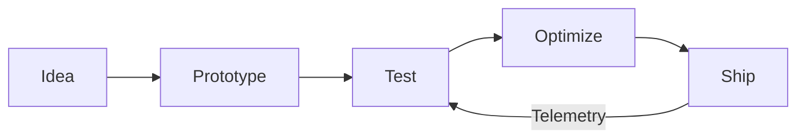

<!-- ===================== -->

<!--   FORMULA 1 README   -->

<!-- ===================== -->

<div align="center">

# 🏁 **FULL THROTTLE DEVELOPER** 🏁


</div>

---

## 🏎️ Driver Profile

```yaml
Name: Your Name
Role: Software Engineer / Developer
Team: Independent Garage
Engine: Coffee + Curiosity
Philosophy: "If you no longer push the limit, you’re not racing."
```

---

## ⚙️ Tech Garage

<table>
<tr>
<td align="center"><b>Power Unit</b></td>
<td>

* 🧮 Languages: `Fortran`, `Haskell`, `Python`, `C++`, `C#`
* 🧠 AI / LLM: `LlamaIndex`, `LangChain`, `RAG`, `Embeddings`
* 🎮 Game Tech: `Unity`, `Unreal Engine`

</td>
</tr>
<tr>
<td align="center"><b>Performance Stack</b></td>
<td>

* 🚀 HPC & Parallelism: `MPI`, `OpenMP`, `CUDA (learning)`
* ⚙️ Systems: `Linux`, `Low-level optimization`, `Numerics`
* 📊 Data & Scientific Computing

</td>
</tr>
<tr>
<td align="center"><b>Aero Package</b></td>
<td>

* Functional programming mindset
* High-performance & memory-aware design
* Correctness > hype

</td>
</tr>
<tr>
<td align="center"><b>Support Crew</b></td>
<td>

* 🌐 Web (secondary): `React`, `Next.js`, `APIs`
* 🛠️ Tooling: `Docker`, `Git`, `CI/CD`

</td>
</tr>
</table>

---

## 🟢 Live Telemetry

<div align="center">


</div>

---

## 🧪 Wind Tunnel (Featured Projects)

<details>
<summary>🧮 <b>Project Pole Position</b> – HPC / Scientific Computing</summary>

* ⚡ Fortran / C++ numerical kernels
* 🧵 Parallelized with MPI / OpenMP
* 📈 Designed for scale & efficiency

</details>

<details>
<summary>🧠 <b>Project Neural Apex</b> – AI / LLM Systems</summary>

* 🔍 RAG pipelines with LlamaIndex & LangChain
* 📚 Knowledge-aware AI systems
* ⚙️ Focus on reliability & evaluation

</details>

<details>
<summary>🎮 <b>Project Simulation Grid</b> – Game / Engine Tech</summary>

* 🕹️ Unity & Unreal experimentation
* 🧠 Physics, rendering, gameplay systems
* ⚙️ C++ / C# performance-sensitive code

</details>

<details>
<summary>🌐 <b>Project Control Panel</b> – Web (Secondary)</summary>

* Clean dashboards & tooling
* APIs for AI / HPC backends

</details>

---

## 🟥 Race Strategy



---

## 🏆 Career Highlights

* 🥇 Shipped production-grade systems
* 🥈 Consistent contributor & problem solver
* 🥉 Always learning, always improving

---

## 📡 Radio Contact

<div align="center">

[](https://linkedin.com/in/YOURNAME)
[](https://your-site.dev)
[](mailto:you@email.com)

</div>

---

<div align="center">

### 🏁 *"Push now. Question later."*


</div>
